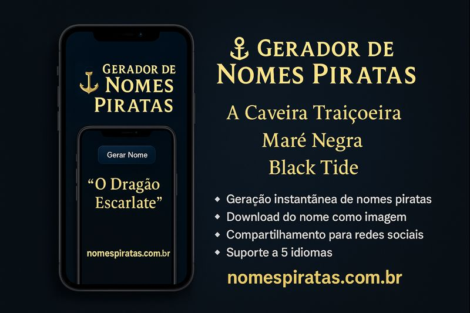

## ☠️ Pirate Name Generator

A fun and creative web-based project developed to generate random pirate-style names.
It can be used for RPG characters, pirate ships, nicknames, or creative inspiration.

## 🌐 Live Demo
👉 https://nomespiratas.com.br

## 📂 GitHub Repository
👉 https://github.com/firstmsv/gerador-pirata

## 🎯 Project Purpose
The purpose of this project is to practice frontend development concepts and user interaction
while delivering a simple and entertaining experience.

## ✨ Features
- Random pirate name generation
- Unique and creative name combinations
- Simple and intuitive interface
- Multi-language support (planned / experimental)

## 🛠️ Technologies Used
- HTML
- CSS
- JavaScript (Vanilla)

## 🚀 How to Use
1. Open the live demo link above
2. Click the generate button
3. A random pirate name will be displayed instantly

## 📌 Project Type
Personal / Study project focused on frontend fundamentals and creative development.

